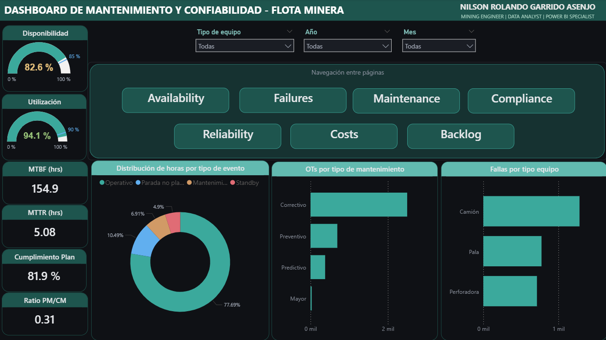
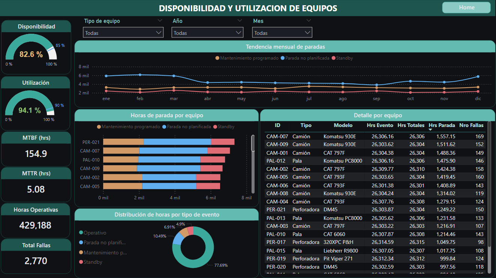
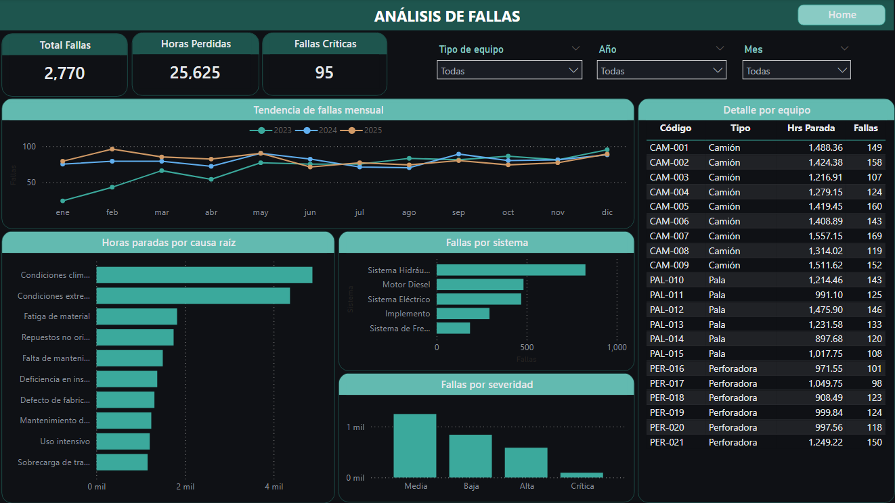
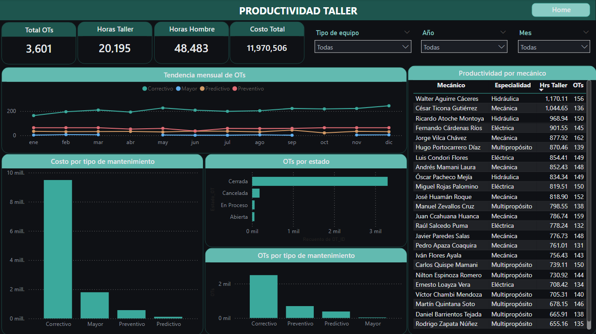
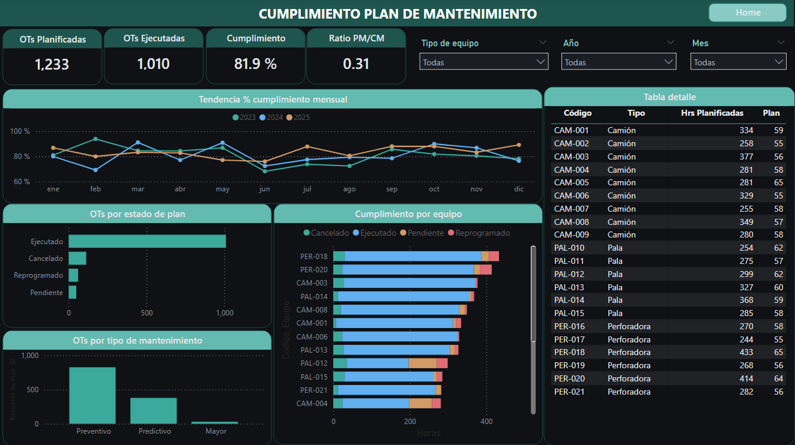
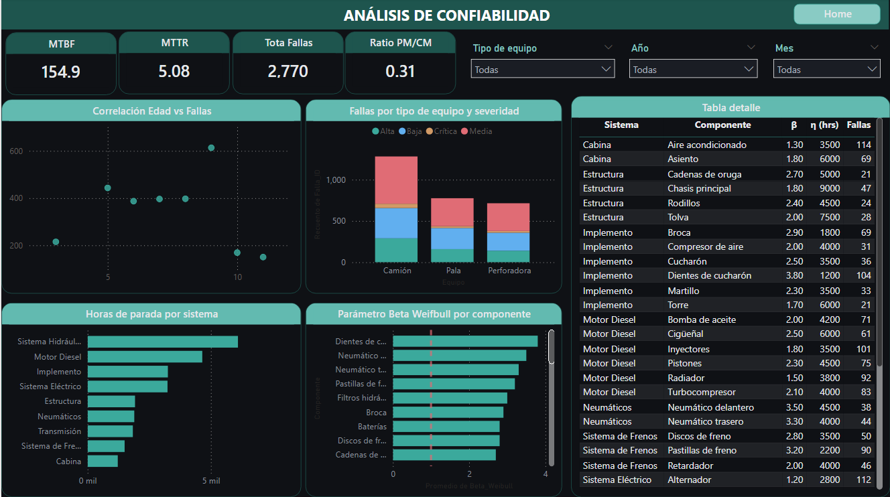
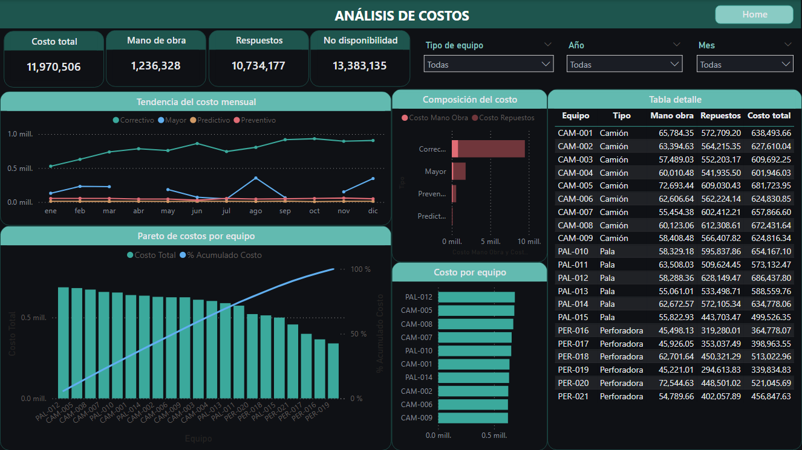
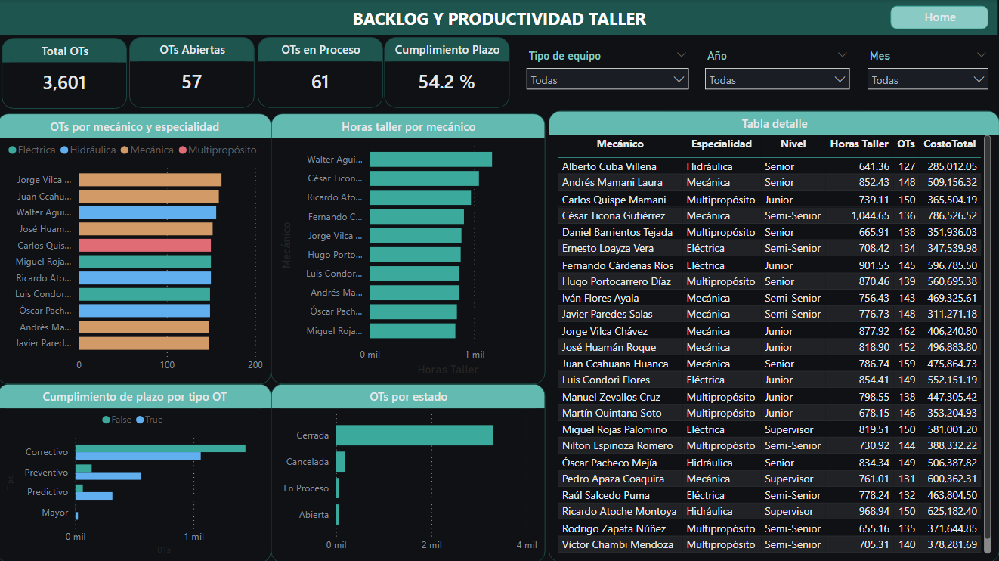

#### Si te resulta util este proyecto, apoyalo con un [](https://github.com/nrgarridoa/powerbi-maintenance-reliability/stargazers) en el repositorio.

---

# Dashboard de Mantenimiento y Confiabilidad - Flota Minera

> **En mineria a cielo abierto, cada hora de equipo parado cuesta entre USD 800 y USD 5,000. Con un ratio PM/CM de 0.31 (cuando el world-class es 0.80), esta operacion gasta USD 13.4M en lucro cesante — mas que los USD 12M que invierte en mantenimiento directo.**

Este dashboard transforma datos de operacion, fallas y ordenes de trabajo en inteligencia de mantenimiento. Permite a superintendentes de mantenimiento, planificadores y jefes de confiabilidad **tomar decisiones basadas en datos** sobre donde enfocar el mantenimiento preventivo, que equipos priorizar y como reducir costos de parada.

[](https://app.powerbi.com/view?r=eyJrIjoiY2I4ZWI5MWMtZDVlNC00OTc5LTliMTgtOWZkMDVjZjAzYTRmIiwidCI6ImY3YWNmODc2LWU3ZTgtNDQ0Yy05NWFlLWY5NTQ4YWNmZTMyZiIsImMiOjR9)

---

## Vista previa

| Home | Availability |
|:---:|:---:|
|  |  |

| Failures | Maintenance |
|:---:|:---:|
|  |  |

| Compliance | Reliability |
|:---:|:---:|
|  |  |

| Costs | Backlog |
|:---:|:---:|
|  |  |

---

## Qué problema resuelve

| Sin este dashboard | Con este dashboard |
|---|---|
| La disponibilidad se revisa al cierre de mes | Disponibilidad en tiempo real por equipo, tipo y periodo |
| No se sabe que equipo genera mas costo de parada | Pareto 80/20 que identifica los equipos mas costosos |
| El ratio PM/CM no se mide | Ratio PM/CM visible (0.31 vs 0.80 world-class) |
| Las fallas se analizan por separado de los costos | Vista cruzada: falla → causa raiz → costo → equipo |
| No hay visibilidad del backlog de OTs | OTs abiertas, en proceso y cumplimiento de plazo por tipo |
| Cada area maneja sus propios reportes | Una sola fuente de verdad con 8 paginas interconectadas |

---

## Hallazgos clave

Los datos revelan patrones criticos para la gestion de mantenimiento:

**1. El costo de NO mantener supera al costo de mantener**
- Costo de mantenimiento directo: **USD 11.97M**
- Costo de no disponibilidad (lucro cesante): **USD 13.38M**
- Cada dolar no invertido en preventivo genera mas de un dolar en paradas

**2. El mantenimiento es 70% reactivo**
- Ratio PM/CM de **0.31** (31% proactivo / 69% reactivo)
- World-class es **0.80** (80% proactivo / 20% reactivo)
- El correctivo concentra **USD 8.5M** del costo total

**3. El sistema hidraulico es el cuello de botella**
- Lidera en horas de parada y numero de fallas
- Componentes con Beta Weibull > 3 (desgaste acelerado): dientes de cucharon (β=3.80), neumaticos (β=3.50)
- Oportunidad clara para mantenimiento basado en condicion

**4. Solo el 54% de las OTs cumplen plazo**
- 57 OTs abiertas + 61 en proceso
- Correctivo tiene peor cumplimiento que preventivo
- Indica necesidad de mejorar la planificacion y dotacion del taller

---

## Páginas del dashboard

### Home
Panorama ejecutivo con 6 KPIs clave: disponibilidad (82.6%), utilizacion (94.1%), MTBF (154.9 hrs), MTTR (5.08 hrs), cumplimiento plan (81.9%) y ratio PM/CM (0.31). Navegacion por botones a las 7 paginas de analisis. Graficos resumen de distribucion de horas, OTs por tipo y fallas por tipo de equipo.

### Availability
Disponibilidad y utilizacion de la flota. Medidores con benchmark (85% y 90%), tendencia mensual de horas de parada por tipo de evento, horas de parada desglosadas por equipo (barras apiladas sin operativo), donut de distribucion de tiempo y tabla detalle por equipo.

### Failures
Analisis de fallas. 3 KPIs (2,770 fallas, 25,625 hrs perdidas, 95 criticas). Tendencia mensual por año, causa raiz top 10 (condiciones climaticas lidera), fallas por sistema top 5 (hidraulico lidera), distribucion por severidad y tabla detalle.

### Maintenance
Productividad de taller. KPIs: 3,601 OTs, 20,195 hrs taller, 48,483 hrs hombre, USD 12M costo total. Tendencia de OTs por tipo de mantenimiento, costo por tipo, estado de OTs (3,301 cerradas), y tabla de productividad por mecanico con especialidad.

### Compliance
Cumplimiento del plan de mantenimiento. KPIs: 1,233 OTs planificadas, 1,010 ejecutadas, 81.9% cumplimiento, ratio PM/CM 0.31. Tendencia mensual de % cumplimiento por año, OTs por estado de plan, cumplimiento por equipo (barras apiladas) y tabla detalle.

### Reliability
Analisis de confiabilidad. Scatter de correlacion edad vs fallas, parametro Beta Weibull por componente con linea de referencia en β=1 (mortalidad infantil vs desgaste), horas de parada por sistema, fallas por tipo de equipo y severidad, tabla de componentes con β y η.

### Costs
Analisis de costos. KPIs: USD 12M costo total, USD 1.2M mano de obra, USD 10.7M repuestos, USD 13.4M no disponibilidad. Grafico Pareto por equipo con % acumulado, composicion mano de obra vs repuestos, tendencia mensual por tipo de mantenimiento y tabla detalle.

### Backlog
Backlog y productividad del taller. KPIs: 57 OTs abiertas, 61 en proceso, 54.2% cumple plazo. OTs por mecanico y especialidad, horas taller por mecanico (top 10), cumplimiento de plazo por tipo de OT y tabla detalle con nivel y costo por mecanico.

### Equipment Detail (Drill-through)
Pagina oculta accesible desde clic derecho en cualquier equipo. Muestra informacion del equipo (tipo, modelo, edad, criticidad), tendencia mensual de horas de parada, fallas por componente e historial completo de OTs.

---

## Contexto de la operación

| Parametro | Valor |
|---|---|
| **Tipo de operacion** | Tajo abierto (open pit) |
| **Ubicacion** | Sierra peruana |
| **Flota** | 21 equipos: 9 camiones, 6 palas, 6 perforadoras |
| **Marcas** | Caterpillar (797F, 793F, 6060), Komatsu (930E, PC8000), Liebherr (R9800), Epiroc (320XPC, Pit Viper 271), DM45 |
| **Periodo** | 3 años (2023 - 2025) |
| **Volumen de datos** | ~74,000 registros (eventos + fallas + OTs + plan) |
| **Datos** | Sinteticos generados con distribuciones Weibull realistas (seed=42) |

---

## Autor

### Nilson Rolando Garrido Asenjo

**Mining Engineer | Data Analyst | Power BI Developer**

[](https://nrgarridoa.github.io)
[](https://www.linkedin.com/in/nrgarridoa)
[](https://www.youtube.com/@nrgarridoa)
[](mailto:nrgarridoa@gmail.com)

Ingeniero de Minas (UNC, primer puesto) y Administrador Industrial (SENATI) con trayectoria en gran mineria, industria farmaceutica y manufactura de alimentos. He liderado equipos de campo en Newmont Yanacocha, Gold Fields y Silver Mountain, dirigido proyectos tecnologicos en CODEa UNI y ejecutado consultoria de reconciliacion de mineral para Chinalco y reportabilidad operativa para Antamina.

Mi enfoque es transformar datos operativos en inteligencia para la toma de decisiones, combinando experiencia de campo con herramientas como Power BI, Python, SQL y DAX. Piloto de drones con operaciones en superficie (fotogrametria, volumetria) y en subterranea (LiDAR con Elios 3 para Flyability). Docente de Power BI y Python aplicado a mineria.

Formacion continua en Platzi, Coursera, iSE-Latam y Netzun en analitica de datos, programacion, gestion agil de proyectos y tecnologias mineras.

[](https://github.com/nrgarridoa)

---

<details>
<summary><strong>Documentación Técnica (clic para expandir)</strong></summary>

## Modelo de datos

Modelo estrella con 7 dimensiones y 4 tablas de hechos:

```
Dim_Fecha ──────┬──> Fact_Eventos_Operacion (66,148)
Dim_Equipo ─────┤──> Fact_Fallas (2,770)
Dim_Turno ──────┤──> Fact_OT (3,601)
Dim_Componente ─┤──> Fact_Plan_Mantenimiento (1,233)
Dim_CausaRaiz ──┘
Dim_Actividad ──┘
Dim_Mecanico ───┘
```

| Tabla | Tipo | Registros | Descripcion |
|---|---|---|---|
| Fact_Eventos_Operacion | Hechos | 66,148 | Eventos operativos por equipo (operativo, parada, standby, mto) |
| Fact_Fallas | Hechos | 2,770 | Registro de fallas con componente, causa raiz y severidad |
| Fact_OT | Hechos | 3,601 | Ordenes de trabajo con costos, horas y cumplimiento |
| Fact_Plan_Mantenimiento | Hechos | 1,233 | Plan de mantenimiento preventivo/predictivo/mayor |
| Dim_Fecha | Dimension | 1,096 | Calendario 2023-2025 con MesCorto ordenado |
| Dim_Equipo | Dimension | 21 | Equipos con tipo, modelo, edad, costos hora |
| Dim_Componente | Dimension | 36 | Componentes con parametros Weibull (Beta, Eta) |
| Dim_CausaRaiz | Dimension | 16 | Causas raiz en 6 categorias |
| Dim_Actividad | Dimension | 20 | Actividades de mantenimiento |
| Dim_Mecanico | Dimension | 25 | Mecanicos con especialidad, nivel y costo hora |
| Dim_Turno | Dimension | 2 | Dia y noche |

## Medidas DAX

```dax
// Horas por tipo de evento
Hrs Totales        = SUM(Fact_Eventos_Operacion[Horas_Evento])
Hrs Operativas     = CALCULATE([Hrs Totales], Fact_Eventos_Operacion[Tipo_Evento] = "Operativo")
Hrs Standby        = CALCULATE([Hrs Totales], Fact_Eventos_Operacion[Tipo_Evento] = "Standby")
Hrs Parada NoPlan  = CALCULATE([Hrs Totales], Fact_Eventos_Operacion[Tipo_Evento] = "Parada no planificada")
Hrs Mnt Programado = CALCULATE([Hrs Totales], Fact_Eventos_Operacion[Tipo_Evento] = "Mantenimiento programado")

// Confiabilidad
Nro Fallas         = COUNTROWS(Fact_Fallas)
MTBF (hrs)         = DIVIDE([Hrs Operativas], [Nro Fallas])
MTTR (hrs)         = DIVIDE([Hrs Mnt Correctivo], [Nro Fallas])
Disponibilidad %   = DIVIDE([Hrs Totales] - [Hrs Parada NoPlan] - [Hrs Mnt Programado], [Hrs Totales])
Utilizacion %      = DIVIDE([Hrs Operativas], [Hrs Operativas] + [Hrs Standby])

// Costos
Costo Total MTO         = SUM(Fact_OT[Costo_Total_USD])
Costo Mano Obra         = SUM(Fact_OT[Costo_ManoObra_USD])
Costo Repuestos         = SUM(Fact_OT[Costo_Repuestos_USD])
Costo No Disponibilidad = SUMX(Fact_Fallas, RELATED(Dim_Equipo[Costo_Hora_Parada_USD]) * Fact_Fallas[Horas_Parada_Equipo])

// Plan y ratio
OTs Planificadas = COUNTROWS(Fact_Plan_Mantenimiento)
OTs Ejecutadas   = CALCULATE([OTs Planificadas], Fact_Plan_Mantenimiento[Estado_Plan] = "Ejecutado")
% Cumplimiento   = DIVIDE([OTs Ejecutadas], [OTs Planificadas])
Ratio PM/CM      = DIVIDE([OTs PM], [OTs PM] + [OTs CM])

// Productividad
Horas Hombre     = SUM(Fact_OT[Horas_Hombre])
AVG Reparacion   = AVERAGE(Fact_OT[Horas_Taller])
Productividad    = DIVIDE([Horas Hombre], [Horas Taller Total])
Total OTs        = COUNTROWS(Fact_OT)
```

## Tema visual

Archivo `tema_mantenimiento_dark.json` — design system dark premium:

| Elemento | Color | Hex |
|---|---|---|
| Fondo canvas | Negro profundo | `#0F1115` |
| Superficies | Gris oscuro | `#1A1D24` |
| Bordes | Gris medio | `#2A2D34` |
| Texto primario | Blanco suave | `#E6E8EB` |
| Texto secundario | Gris claro | `#888E99` |
| Acento principal | Teal | `#3BA99C` |
| Alerta | Rojo | `#E06C75` |
| Warning | Ambar | `#D19A66` |

## Estructura del repositorio

```
powerbi-maintenance-reliability/
|
|-- README.md
|-- LICENSE
|-- .gitignore
|
|-- data/
|   |-- Dim_Fecha.csv
|   |-- Dim_Equipo.csv
|   |-- Dim_Componente.csv
|   |-- Dim_CausaRaiz.csv
|   |-- Dim_Actividad.csv
|   |-- Dim_Mecanico.csv
|   |-- Dim_Turno.csv
|   |-- Fact_Eventos_Operacion.csv
|   |-- Fact_Fallas.csv
|   |-- Fact_OT.csv
|   |-- Fact_Plan_Mantenimiento.csv
|
|-- screenshots/
|   |-- home.png
|   |-- availability.png
|   |-- failures.png
|   |-- maintenance.png
|   |-- compliance.png
|   |-- reliability.png
|   |-- costs.png
|   |-- backlog.png
|   |-- detail.png
|
|-- scripts/
|   |-- generate_mining_data.py
```

## Cómo usar los datos

1. **Clonar el repositorio**
   ```
   git clone https://github.com/nrgarridoa/powerbi-maintenance-reliability.git
   ```

2. **Abrir en Power BI Desktop**
   - Crear un nuevo archivo .pbix
   - Importar los 11 CSV desde la carpeta `data/`
   - Crear relaciones segun el modelo estrella
   - Crear tabla `_Medidas` y pegar las medidas DAX

3. **Aplicar el tema**
   - El tema `tema_mantenimiento_dark.json` se puede descargar desde `data/` o recrear con los colores de la tabla

## Stack tecnológico

| Herramienta | Uso |
|---|---|
| **Power BI Desktop** | Desarrollo del dashboard (formato PBIP) |
| **DAX** | 26 medidas organizadas en 6 bloques funcionales |
| **Python** | Generacion de datos sinteticos con distribuciones Weibull |
| **Git / GitHub** | Versionamiento y publicacion |

## Referencias

- **ISO 14224** — Taxonomia de componentes para equipos industriales
- **Weibull β**: β<1 mortalidad infantil, β=1 aleatorio, β>1 desgaste
- **World-class maintenance**: 80% proactivo (PM+PdM) / 20% reactivo (CM)

</details>

---

[MIT License](https://github.com/nrgarridoa/powerbi-maintenance-reliability/blob/main/LICENSE)
